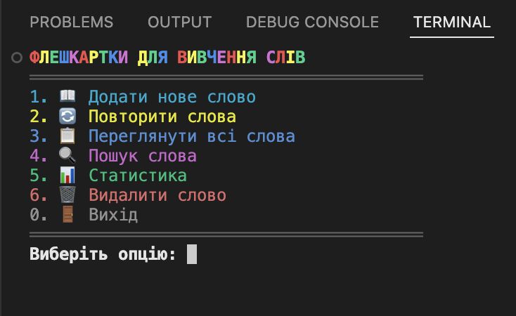

# Консольний додаток для вивчення нових слів - flashcards

**_Виконали: студенти групи ІМ-33 Набока Тимур, Пилипчук Вероніка, Срібранець Марія._**

## Функціонал

**Стек технологій: Node.js, MongoDB, Docker, readline-sync**

➕ Додавання нових слів з перекладом, визначенням та прикладами використання

🔄 Інтелектуальна система повторення (spaced repetition)

📊 Детальна статистика вивчення

🔍 Пошук слів

📋 Перегляд всіх доданих слів

🗑️ Видалення слів

💾 Збереження даних в базу даних (MongoDB)

## Швидкий запуск через Docker (рекомендовано)

1. Склонуйте репозиторій:

```bash
git clone <repository-url>
cd flashcards-app
```

2. Запустіть через Docker Compose:

```bash
docker-compose up --build
```

3. Після запуску ви побачите головне меню програми.

## Використання



1. **Додати нове слово** - додавання слова з перекладом
2. **Повторити слова** - сесія повторення слів
3. **Переглянути всі слова** - список всіх доданих слів
4. **Пошук слова** - пошук за словом або перекладом
5. **Статистика** - загальна статистика вивчення
6. **Видалити слово** - видалення слова з бази
7. **Вихід** - завершення роботи програми

### Система повторення

Додаток використовує алгоритм spaced repetition:

- Слова з високим відсотком правильних відповідей (90%+) повторюються рідше (раз на тиждень)
- Слова з середнім відсотком (70-89%) повторюються кожні 3 дні
- Слова з низьким відсотком (50-69%) повторюються щодня
- Нові або складні слова повторюються кожні 12 годин

### Система складності

- Рівень складності: 1-5
- Автоматично змінюється на основі ваших результатів
- Правильні відповіді знижують складність
- Неправильні відповіді підвищують складність

### Додаток відстежує:

- Загальну кількість слів
- Кількість спроб і правильних відповідей
- Відсоток успіху
- Середню складність слів
- Дату останнього повторення для кожного слова
